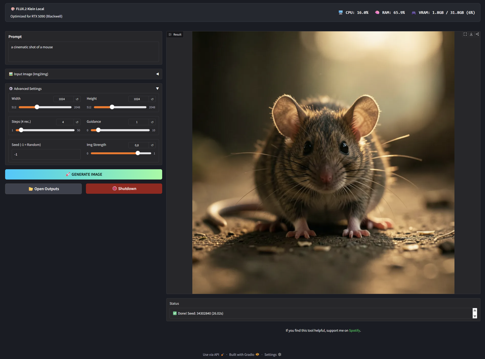
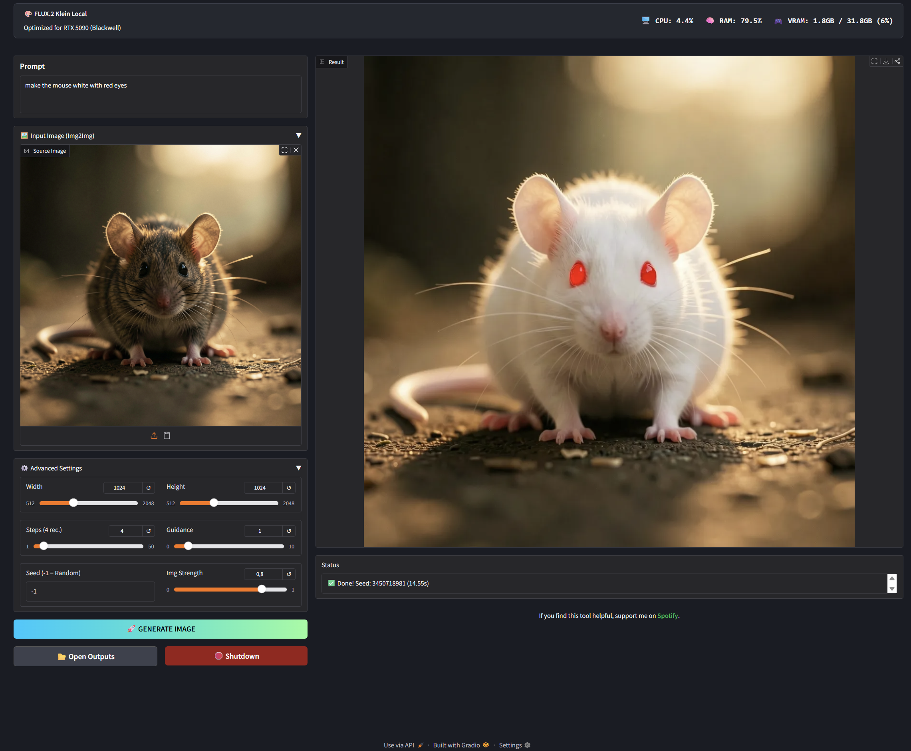

# ⚡ FLUX.2 Klein Local GUI (RTX 5090 Optimized)

A lightweight, high-performance local interface for **FLUX.2 Klein (9B)** by Black Forest Labs.
This project is specifically optimized for **NVIDIA RTX 5090** GPUs, utilizing PyTorch Nightly (CUDA 13.0) and `bfloat16` precision for maximum speed.

<table>
<tr>
<td>

</td>
<td>

</td>
</tr>
</table>

## 🚀 Features

* **Fully Portable:** Embedded Python — no system Python installation required.
* **Optimized for Blackwell:** Built on PyTorch Nightly with CUDA 13.0 support for RTX 5090.
* **Fast Generation:** Pre-configured for the distilled "Klein" model (only 4 steps required).
* **Dual Modes:** Supports **Text-to-Image** and **Image-to-Image**.
* **Memory Efficient:** Implements CPU offloading to manage the 9B parameter model effectively.
* **One-Click Installer:** Includes a robust batch script for easy setup on Windows.
* **Real-time Monitoring:** Live CPU, RAM, and VRAM monitoring in the GUI.

## 📋 Prerequisites

* **OS:** Windows 10/11
* **GPU:** NVIDIA RTX 3090 / 4090 / 5090 (24GB+ VRAM recommended)
* **Git:** Required to install dependencies.

## 🛠️ Installation

1.  Download this repository.
2.  Double-click **`install.bat`**.
3.  The script will:
    * Download and set up an embedded Python environment (`python_env/`).
    * Install all dependencies (PyTorch Nightly, Diffusers, Gradio, etc.).

No system Python, no virtual environment, and no Hugging Face login required.

## Usage
Double-click `start_FLUX2-KLEIN-9B_gui.bat`.

Wait for the model to load (first run downloads approx. 20GB to `model_cache/`).

The GUI will open automatically in your browser (usually `http://127.0.0.1:7860`).

## Recommended Settings for Klein
The Klein model is distilled, meaning it behaves differently than the base model:

- **Steps**: 4 steps is the sweet spot.
- **Guidance Scale**: Leave at 1.0.
- **Resolution**: 1024x1024 works best.

## Troubleshooting
- **OOM (Out of Memory)**: Ensure you don't have other heavy GPU apps running. The app uses CPU offloading to save VRAM.
- **Python environment not found**: Make sure you ran `install.bat` before starting the app.

## License
This project uses the FLUX.2 model. Please review the [Black Forest Labs license](https://huggingface.co/black-forest-labs/FLUX.2-klein-9B) for commercial usage restrictions.

## 🤝 Support

This is a free open-source project. I don't ask for donations.
However, if you want to say "Thanks", check out my profile on **[Spotify](https://open.spotify.com/artist/7EdK2cuIo7xTAacutHs9gv?si=4AqQE6GcQpKJFeVk6gJ06g)**.
A follow or a listen is the best way to support me! 🎧
